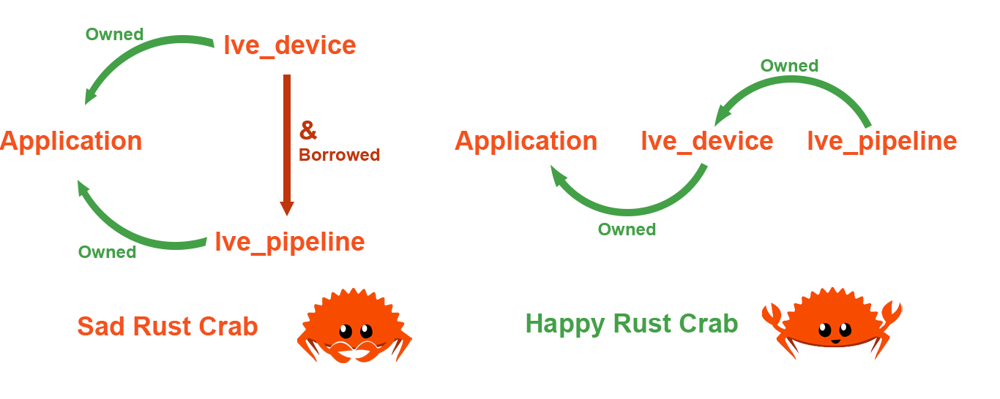

# Rust Light Vulkan Engine

This is a translation of Brendan Galea's Vulkan tutorial into rust using the [Ash](https://github.com/MaikKlein/ash) crate.

Original tutorial: [Brendan Galea's YouTube Page](https://www.youtube.com/c/BrendanGalea)

Each commit will correspond to a video from this tutorial.

## Requirements

You will need to have the [LunarG Vulkan SDK](https://www.lunarg.com/vulkan-sdk/) installed and on linux 
you will need to add the library and layers to your path.

## Things to Note

- Unlike the tutorial, this translation will use the winit window API as it is fully written in rust. 
This will result in some large deviations from the videos.
- Due to the methodology of rust being incredibly different to that of C++, the structure of the code 
will be different in some areas. These changes will be highlighted with a hopefully correct :) explanation 
of why this is the case.
- To get the most out of the tutorial, I recommend trying to follow along with the video and translate
the code yourself and use this repository if you get stuck or want to copy large amounts of code (such 
as videos 3, 4, and 5). 

To use the logging functionality in this code, you need to set the ```RUST_LOG``` environment variable:

#### Windows PowerShell
```
$env:RUST_LOG="debug"
```

#### Linux
```
RUST_LOG=vulkan_tutorial_ash=debug cargo run
```

More information about using this crate can be found in the [documentation](https://docs.rs/log/0.4.14/log/).

## Acknowledgements

Big thanks to [Brendan Galea](https://www.youtube.com/c/BrendanGalea) for making the tutorial that this code is based on, and Alexander Overvoorde
for making [The Vulkan Tutorial](https://vulkan-tutorial.com/) that I first learnt Vulkan from. Also thanks to [Adrien Ben](https://github.com/adrien-ben)
for translating Alex's tutorial, a bunch of this code was yoinked from [that repo](https://github.com/adrien-ben/vulkan-tutorial-rs) :)

# 1: Opening a Window ([link](https://www.youtube.com/watch?v=lr93-_cC8v4&ab_channel=BrendanGalea))
- Later versions of [winit](https://docs.rs/winit/0.25.0/winit/) (0.20+) use an architecture that is very different to glfw. Because of this the structure presented in the tutorial will not work, or will be very weird to implement. As such, there is no lve_window struct and ownership of the window has been moved to the application (first_app).

# 2: Graphics Pipeline Overview ([link](https://www.youtube.com/watch?v=_riranMmtvI&ab_channel=BrendanGalea))
- A `build.rs` file was added to compile the shader files when the program is built. This is just a replacement 
for the shell script presented in the video.
- "We're about half way to seeing our first triangle on screen"... I've never heard a more blatant lie.

# 3: Device Setup & Pipeline cont. ([link](https://www.youtube.com/watch?v=LYKlEIzGmW4&t=3s&ab_channel=BrendanGalea))
- Due to the nature of Rust, a lot of the functions that were `void` in the tutorial now return things. This is so we can properly initialise the `LveDevice` struct by allowing the functions to borrow these Vulkan structs.
- `device_extensions` does is not a global constant anymore as ash requires the extension names to be given by a functions, and hence can't be stored in a constant. It can now be found in the `LveDevice::get_device_extensions()` function.
- Due to the lack of lve_window module, it was more convenient to use the `create_surface()` function from the [ash-window](https://docs.rs/ash-window/0.7.0/ash_window/) crate in the `LveDevice::create_surface()` function.
The naming here is a little confusing, sorry about that.
- You will also note that ash has two surface types, `Surface` and `vk::SurfaceKHR`. The former is a struct containing the functions that act on the surface, while the latter is the Vulkan surface itself.
- The biggest deviation in this code is the fact that the `LveDevice` now owns the `LvePipeline` instead of the application owning both. In the tutorial, Brendan says that having a reference to the device in the pipeline 
can be unsafe as the device needs to be destroyed after the pipeline. In Rust, if it can be unsafe it won't compile, so some restructuring had to be done. 



- Overall, the way that extensions are handled in this implementation are slightly different so don't expect the exact same console output as the one shown in the video.

# 4: Fixed Function Pipeline Stages ([link](https://www.youtube.com/watch?v=ecMcXW6MSYU&ab_channel=BrendanGalea))
- Some pipeline builder functions were commented out as they were optional and required null pointers, something I'm not sure is implemented in rust.
- Pipeline destructor function was already implemented in the previous commit.

# 5.1: Swap Chain Overview ([link](https://www.youtube.com/watch?v=IUYH74MqxOA&t=238s&ab_channel=BrendanGalea))
- Architecture change made in tutorial 3 commit was once again changed, as an approach more similar to that given by the tutorial was found. The `lve_device`, `lve_swapchain`, and `lve_pipeline` are all now owned by the application.
The conflicting issue in tutorial 3 was the destruction of the Vulkan objects, which most of the time require a reference to the device. By making the application handle the destruction of everything when the struct is dropped, we can pass the device to the other modules without having any cyclical linking trees.
    - Each struct now has a ` pub unsafe fn destroy()` function that handles the destruction of its fields.
- public get functions are discouraged in Rust, so instead those variables were passed to functions when they were needed and will individually be made public when they are needed in other modules.
- No vectors need to be resized in rust, so all those lines were skipped.
- All functions that were `void` in the tutorial now return their respective structs similarly to tutorial 3.
- Some reformatting was done (witch should have been done during the other commits). This was done using rusts inbuilt formatter, so should not be too hard to replicate
- My machine is currently giving validation errors at the end of this tutorial. For now I will leave this issue to see if fully implementing everything in the next tutorial fixes the issue, if not then there will be another commit with a fix (hopefully)

# 5.2: Command Buffers Overview ([link](https://www.youtube.com/watch?v=_VOR6q3edig&t=4s&ab_channel=BrendanGalea))
- The validation errors from the previous tutorial have not disappeared. Will look into it more.
- The triangle also does not display color correctly, being a dark maroon when it's supposed to be red, 
and bright green when the other color values are set to 1.0 in the fragment shader file. This is probably linked to the validation errors.

## 5.2.1: Debugging
- From reading the validation layer output (should have done this when they came up :) ), it became clear that the depth stencil create info struct was not given a format, hence causing the first half of the errors.
- For the remaining errors, something much stranger was happening. The errors were along the lines of: ` pCreateInfos[0].pColorBlendState->pAttachments[0].srcColorBlendFactor (51) does not fall within the begin..end range of the core VkBlendFactor enumeration tokens and is not an extension added token.` Considering that this value (`srcColorBlendFactor` in this case) was set to be an ash enum (such as `vk::BlendFactor::ONE` which should have a vale of 1), it is hard to believe that `vkCreateGraphicsPipelines()` is receiving a value of 51 in this example. This seems to be an issue with the `color_blend_attachment` and `color_blend_info` structs as they seem 
to be avoiding rusts memory safety checks. As a result, passing this struct around resulted in random bits of 
memory being read which caused strange errors. 
    - This also caused the program to behave differently every time it was run.
- To solve this, the `color_blend_attachment` and `color_blend_info` struct definitions were moved to the `LvePipeline::create_graphics_pipeline()` function so that they would never leave scope.
- This seems to be an issue with `ash`, might be solved in more recent versions. 

# 6: Vertex Buffers ([link](https://www.youtube.com/watch?v=mnKp501RXDc&t=195s&ab_channel=BrendanGalea))
- No changes of note from the tutorial
- A solution to the exercise in the video can be found in the fork.

# 7: Fragment Interpolation ([link](https://www.youtube.com/watch?v=ngoZZkMuCOM&t=12s&ab_channel=BrendanGalea))
- They is no rust equivalent of `offsetof()` that I am aware of at this point in time. So a workaround was used that is only slightly better than just hard coding in an offset of 8 bytes :).
- I also decided to finally remove the drop implementation for the `lve_*` sub-modules. They weren't really doing anything.

# 8: Swapchain Recreation and Dynamic Viewports ([link](https://www.youtube.com/watch?v=0IIqvi3Z0ng&ab_channel=BrendanGalea))
- Winit is very different to glfw, so the first part of this tutorial is very different (but in my opinion, a lot nicer).
- Because of winit's differences, I saw a, in my opinion, much nicer way of handling window resizing. Whenever winit detects that the window is resized, the `recreate_swapchain()` function is called. Since we know that the 
old swapchain is out of date at this point. Then in the `draw()` function, recreate swapchain is only called if there is some other event that causes the swapchain to become out of date.
- There is a possible mistake in Brendan's code which he doesn't notice as he is on macOS. As he points out macOS pauses the program until the window has finished resizing, meaning that he is not creating as many new swapchains as other platforms such as windows or linux. Since the tutorial code does not destroy the old swapchain when it creates a new one, Vulkan begins to have a cry after a large amount of resizing. To resolve this a call to the `LveSwapchain::destroy()` function was added to `recreate_swapchain()`.
- This is also happening to the pipeline, so a call to `LvePipeline::destroy()` was also added.
- The `viewport_count()` and `scissor_count()` needed to be set to 1 while creating `viewport_info` as Vulkan thinks that 0 > 1 ...
- Implementation of old swapchain is also a bit different, instead of passing the whole `LveSwapchain` struct, we just pass the old swapchain_khr into `LveSwapchain::new()`. This is wrapped in an option to account for the times where there is no old swapchain.

# 9: Push Constants ([link](https://www.youtube.com/watch?v=wlLGLWI9Fdc&ab_channel=BrendanGalea))
- I could not find a nice way to align the fields of the `SimplePushConstantData` struct, so I just made the position vector a `vec4`. I am not proud of this :).
    - If I find a better method of alignment in the future I will come back and fix this.

## Push Constant Fix:
- It seems that Ash's implementation of push constants requires that the push constants ranges for the 
vertex and the fragment shaders be split into separate structs.
- This also applies for when actually pushing these values, one push for the offset and one push for the color.
- Finally learnt about type aliases, so made some changes that should hopefully lead to less errors in the future.
- Also removed the need for the bytemuck crate as it seemed unnecessary for what I was using it for, wrote some functions to get the specific push constants in slice form.

## Push Constant Fix (for real this time):
- After moving onto the next tutorial, it became apparent that the previous fix was not going to work. It was time to figure out how to properly align the fields of a struct. Since using `#[repr(align(16))]` on a struct 
only aligns the whole struct and not it's fields, I had to get a bit creative. By defining the wrapper struct `Align16<t>(pub T)`, each of the fields of the `SimplePushConstantData` struct can now be aligned.
- Push constants were also made to only affect the vertex shader, as ash was making it hard to send push constants to both the vertex and fragment shaders.

# 10: 2D Transformations ([link](https://www.youtube.com/watch?v=gxUcgc88tD4&ab_channel=BrendanGalea))
- Had to do a little bit of refactoring to allow the rotation to be mutable in the `render_game_objects()` function.
- Also decided to make the type declaration for `Pos` and `Color` and so on module specific to avoid alignment weirdness, but this could become confusing.
- Will fork the cool animation.

# 11: Renderer & Systems ([link](https://www.youtube.com/watch?v=uGRSTRGlZVs&t=1257s&ab_channel=BrendanGalea))
- No big changes of note.
- Will fork the gravity simulation.

# Refactor
- In making the little gravity simulation after the last tutorial, it became apparent that the way the code was set up was not going to work. In the current state, each game object would need its own version of the model, even if it was the exact same model that another object was using. Since we are not modifying the models in the code, this is just inefficient and it takes a while to load and destroy all the models.
    - In the previous version of the code, having the game object contain a reference to the model was (I think, could be wrong) impossible as it was ambiguous when the model should be destroyed.
- To solve this issue, the `LveModel` and the `LveDevice` structs were made to return smart pointers from their constructors. This allows for many different game objects to all access the same model and then release the model (and it vertex buffers) from memory when no game object is using it anymore. To do this, a smart pointer to the `LveDevice` was also needed so that the model could de allocate when it was dropped. While I was at it, I implemented the drop trait for the rest of the modules in the engine, allowing for the same behaviour.
- I will merge these changes with the Gravity sim branch 

## Small edit
- Removed the ID field from the model, the whole point of the refactor was that there would only be one version of each model :)

# 12: Euler Angles & Homogeneous Coordinates ([Link](https://www.youtube.com/watch?v=0X_kRtyVzm4&ab_channel=BrendanGalea))
- No big changes of note.